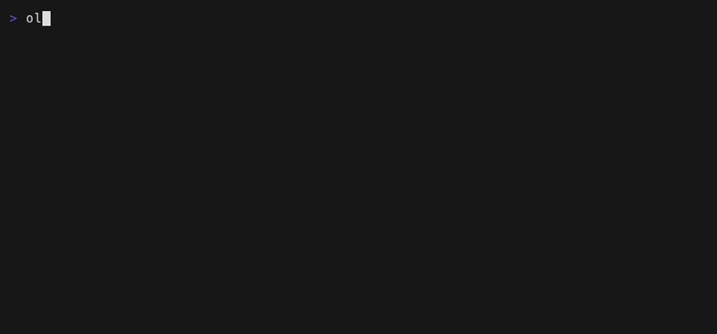

# NixOS Configuration

Daniel's NixOS configuration using flakes for multiple systems. Yes I used Claude to make a lot of this kinda, I just told it to turn all my configs into a flake. I am horrible at documentation and would never write this much detail below.

## Systems

- **local** — NixOS desktop (Sway + Emacs GUI + gaming)
- **terminal** — NixOS terminal-only (x86)
- **terminal-arm** — NixOS terminal-only (aarch64)
- **terminal-darwin-arm** — macOS Apple Silicon
- **terminal-darwin-x86** — macOS Intel
- **node1**, **node2**, **node3** — Kubernetes cluster nodes with iSCSI

## Features

### Boot Management (`boot-common.nix`)
- Automatically cleans old boot entries (keeps last 5 generations)
- Weekly automatic garbage collection (removes items older than 7 days)
- Supports both GRUB and systemd-boot

### Secrets Management (sops-nix)
- Encrypted secrets using age encryption
- Configuration in `.sops.yaml`
- Encrypted secrets stored in `secrets/secrets.yaml` (safe to commit — decryption requires age key)

### Local LLM MCP Router (`pkgs/local-llm-mcp`)



*The router drafting a commit message locally — regenerate with
`nix run nixpkgs#vhs -- docs/demos/local-llm-router.tape` (see `claude/skills/readme-demo/`).*

Self-hosted model routing for small subagent tasks (test/security/general
review) using Ollama + MCP. One shared Home Manager module
(`shared/home/ollama.nix`) runs the Ollama daemon on every system: a systemd
user service on Linux, a launchd agent on macOS (Metal via unified memory).
The desktop overrides the package to `ollama-cuda` in flake.nix;
`local-llm-mcp` and the `ollama` CLI are on PATH everywhere.

```bash
# Pull the default model once
ollama pull qwen3:8b

# agent-shell sessions get the server automatically (shared/emacs/agent-shell.nix).
# The Claude Code CLI needs a one-time user-scope registration:
claude mcp add --scope user local-llm-router -- local-llm-mcp
```

Sonnet-tier model hints (`sonnet`, `claude-sonnet-5`) are mapped to the local
default model via `LOCAL_LLM_MODEL_OVERRIDES`; opus hints deliberately stay
remote. See `claude/skills/local-llm-routing/` for the usage pattern and
`tests/local-llm-mcp/run.sh` for the test suite.

## Usage

### NixOS Setup

1. Clone this repository to `~/.local/dotfiles` (use `--recurse-submodules` for secrets)
2. Set up your age key for secrets (see `secrets/README.md`)
3. Build — the full per-system command list lives in [CLAUDE.md](CLAUDE.md):

```bash
sudo nixos-rebuild switch --flake .#local   # desktop; .#terminal / .#node1-3 likewise
```

### macOS (Darwin) Setup

#### 1. Install Nix with Determinate Installer

```bash
curl --proto '=https' --tlsv1.2 -sSf -L https://install.determinate.systems/nix | sh -s -- install
```

#### 2. Create your machine's flake

Create a new flake that imports this repo. Replace the values marked with `# <-- CHANGE` below.

The key in `darwinConfigurations` must match your machine's hostname so that `--flake .` works without specifying a config name. Run `scutil --get LocalHostName` to find it.

```nix
# flake.nix
{
  inputs = {
    base-dotfiles.url = "github:dscrawford/dotfiles";
  };

  outputs = { self, base-dotfiles }:
  {
    darwinConfigurations.My-MacBook-Pro = base-dotfiles.lib.mkDarwin {  # <-- CHANGE to your hostname (scutil --get LocalHostName)
      hostname = "My-MacBook-Pro";  # <-- CHANGE to match above
      username = "myuser";          # <-- CHANGE to your macOS username (whoami)
      system = "aarch64-darwin";    # <-- CHANGE to "x86_64-darwin" for Intel Macs
      gitUser = {                   # <-- CHANGE to your git identity
        name = "My Name";
        email = "my@email.com";
      };
    };
  };
}
```

`mkDarwin` also accepts these optional parameters:

| Parameter | Default | Description |
|-----------|---------|-------------|
| `gitUser` | `null` | Git identity attrset `{ name, email }` (uses repo default if null) |
| `enableSecrets` | `false` | Enable sops-nix secret management |
| `homeModules` | `[ ./shared/home ]` | Home Manager modules to import |
| `extraModules` | `[]` | Additional nix-darwin modules (certificates, custom services, etc.) |

Use `extraModules` to add machine-specific nix-darwin config — for example, corporate certificates or extra services:

```nix
darwinConfigurations.My-MacBook-Pro = base-dotfiles.lib.mkDarwin {
  hostname = "My-MacBook-Pro";
  username = "myuser";
  system = "aarch64-darwin";
  extraModules = [
    ./certs.nix  # custom CA certificates, proxy config, etc.
  ];
};
```

#### 3. Build and switch

```bash
# First run — git add so the flake can see all files
git add -A

# Build (nix-darwin must be bootstrapped on first run)
nix run nix-darwin -- switch --flake .  # first time only

# Subsequent rebuilds
darwin-rebuild switch --flake .
```

### Updating Dependencies

```bash
# Update all inputs
nix flake update

# Update specific input
nix flake update nixpkgs
```

> **Note:** Always run `git add -A` before rebuilding — Nix flakes only see tracked files.

## Structure

```
.
├── flake.nix                # Inputs and all system configurations
├── lib/                     # Builder functions (mkServer, mkLocal, mkDarwin)
├── shared/
│   ├── common.nix           # Base config for all NixOS systems
│   ├── local-common.nix     # Desktop/terminal overrides
│   ├── server-common.nix    # Server config (static IP, fail2ban, tailscale)
│   ├── darwin-common.nix    # macOS system config (nix-darwin)
│   ├── boot-common.nix      # Boot entry limits and garbage collection
│   ├── kubernetes.nix       # + kube-*.nix, iscsi.nix: cluster node modules
│   ├── users.nix            # Server user accounts
│   ├── home/                # Cross-platform Home Manager (default.nix + per-tool modules)
│   ├── emacs/               # Emacs config assembled from elisp modules (default.nix)
│   ├── sway/                # Sway + Waybar config and scripts (default.nix)
│   └── gaming.nix           # + easyeffects.nix, vr.nix: desktop extras
├── hosts/
│   ├── local/               # NixOS desktop (NVIDIA, Sway, PipeWire, Steam)
│   └── node1..3/            # Kubernetes cluster nodes
├── pkgs/                    # Local packages (claude-code, ruflo, local-llm-mcp, ...)
├── claude/                  # Claude Code settings, hooks, agents, skills
├── docs/                    # Runbooks and research notes
├── tests/                   # Hook, Emacs, and MCP-server tests
├── patches/                 # Temporary upstream patches
└── secrets/                 # Encrypted secrets (sops-nix git submodule)
```

## Important Notes

### Boot Configuration
The boot-common.nix module is automatically imported by all systems and handles:
- Limiting boot menu entries to prevent /boot partition from filling up
- Regular cleanup of old Nix store generations

## Maintenance

### Cleaning Up

The configuration includes automatic cleanup, but you can also manually clean:

```bash
# Remove old generations
sudo nix-collect-garbage --delete-older-than 7d

# Remove all old generations (keeps only current)
sudo nix-collect-garbage -d

# Clean up boot entries
sudo nixos-rebuild switch --flake .#local
```

### Checking System Status

```bash
# List generations
sudo nix-env --list-generations --profile /nix/var/nix/profiles/system

# See what's using disk space
nix path-info --recursive --size /run/current-system | sort -nk2
```

## Troubleshooting

### macOS: "not a trusted user" Nix warning

On macOS, you may see `warning: you are not a trusted user of the Nix store` when running `nix build` or similar commands. This is caused by a [macOS bug](https://github.com/NixOS/nix/issues/5885) where peer credentials don't include group membership, so `trusted-users = root @staff` doesn't work.

The `darwin-common.nix` activation script fixes this automatically on `darwin-rebuild switch` by adding your username to `trusted-users` in `/etc/nix/nix.conf`.

If you need to fix it manually:

```bash
echo "trusted-users = root $(whoami)" | sudo tee -a /etc/nix/nix.conf
sudo launchctl kickstart -k system/org.nixos.nix-daemon
```

## Temporary Patches

Patches to remove once upstream fixes land:

- **xdg-desktop-portal-wlr duplicate frame crash** (`patches/xdg-desktop-portal-wlr-fix-duplicate-frame.patch`)
  - Fixes `ext_image_copy_capture_session_v1: session already has a frame object` crash during screen sharing
  - PR: https://github.com/emersion/xdg-desktop-portal-wlr/pull/380
  - Pinned to 0.8.2: 0.8.3 stalls screencasts after the first frame
  - Remove when: a release past 0.8.3 ships the fix

## References

- [NixOS Manual](https://nixos.org/manual/nixos/stable/)
- [Home Manager Manual](https://nix-community.github.io/home-manager/)
- [nix-darwin](https://github.com/LnL7/nix-darwin)
- [Determinate Nix Installer](https://github.com/DeterminateSystems/nix-installer)
- [sops-nix](https://github.com/Mic92/sops-nix)
- [Nix Flakes](https://nixos.wiki/wiki/Flakes)
