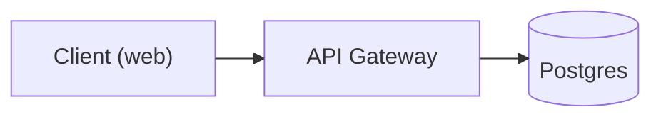

# Diagram as Code

Render, read the image back, fix defects — compiling ≠ readable; read-back is mandatory. Full system design doc → `design-doc` skill (uses this toolchain per figure; adds PDF export, page sizing, shared palette).

## 1. Tool choice

- **Mermaid** (`mmdc`) — default (README/PR/Markdown): GitHub-native, models write it most reliably.
- **D2** (`d2`) — architecture with containers/nesting/icons or >25 nodes: better dense-graph layout, no browser, custom SVG icons.
- **Structurizr DSL** — several consistent views of one system: one model → System Context/Container/Component, C4-enforced.
- **`diagrams-py`** (mingrammer/diagrams) — cloud/MLOps infra: AWS/GCP/Azure/K8s icons.
- **torchview** (per-project dep) — PyTorch internals: headless Graphviz, tensor shapes; Netron lacks CLI export.

Unsure → Mermaid; D2 when its layout visibly fails.

## 2. Constrain first

- One question per diagram, stated in the title.
- One abstraction level — never "Postgres" beside "UserRepository.findById".
- 15–20 nodes max; past that, split rather than shrink fonts.
- `LR` pipelines/request flows; `TB` hierarchies/layered stacks.
- LLMs are weakest on failure/error flows: draw failure edges explicitly.
- Unremovable crossings ⇒ cut nodes, don't fight the engine.

## 3. Write the source

Sources live beside docs (`docs/diagrams/<name>.mmd`/`.d2`), committed — source is the artifact, images build output.

### Mermaid rules

- Quote labels containing anything but letters/digits/spaces: `A["Client (web)"]` — unquoted `( ) [ ] { } : . , / \ ' &` break the parser.
- IDs: no spaces, none before the bracket; labels may have spaces.
- No `style` directives in `sequenceDiagram` (unsupported).
- ELK for anything non-trivial (flowchart/state only):



`mmdc` bundles ELK (no setup). GitHub's renderer lacks ELK: verify README diagrams read without `layout: elk`, or commit the SVG.

### D2 rules

- One syntax; containers nest with `{ }`.
- Always `--layout elk` (default `dagre` crosses more).
- Never TALA — proprietary, watermarks without a paid license.

```d2
client: Client (web) { shape: rectangle }
api: API Gateway
db: Postgres { shape: cylinder }
client -> api: HTTPS
api -> db: SQL
```

## 4. Render

```bash
# Mermaid → PNG for self-review (-s 2 = 2x scale, legible text)
mmdc -i docs/diagrams/arch.mmd -o /tmp/arch.png -s 2 -b white

# Mermaid → SVG artifact for docs
mmdc -i docs/diagrams/arch.mmd -o docs/diagrams/arch.svg -b transparent

# Mermaid → PDF (for LaTeX embedding). --pdfFit crops to the diagram instead of
# padding to US Letter. Always let mmdc export raster/PDF itself: a Mermaid SVG
# put through rsvg-convert loses every node label, because Mermaid draws labels
# in <foreignObject> HTML and librsvg does not implement it. `htmlLabels: false`
# is not a fix — node labels still vanish and label spaces collapse.
mmdc -i docs/diagrams/arch.mmd -o docs/diagrams/arch.pdf --pdfFit -b white

# D2 → SVG artifact, then rasterize for self-review.
# Do NOT use `d2 in.d2 out.png` — PNG export is broken in this nixpkgs build
# (it tries to download a Playwright driver at runtime and 404s).
d2 --layout elk docs/diagrams/arch.d2 docs/diagrams/arch.svg
rsvg-convert -z 2 -o /tmp/arch.png docs/diagrams/arch.svg

# Structurizr: one model → many consistent views, exported as Mermaid
structurizr-cli export -workspace docs/workspace.dsl -format mermaid -output docs/diagrams/

# Python diagrams (mingrammer) — writes its own PNG
diagrams-py docs/diagrams/pipeline.py
```

Non-zero `mmdc`/`d2` exit = syntax error: fix, re-render. Never deliver a failed render.

## 5. Read the image back (do not skip)

`Read` the PNG; check:

**Visual:** overlapping text; removable crossings (flip direction/regroup); aspect ratio (300×4000 ribbon = wrong direction); labels legible at 100% zoom; no node dwarfing the rest (over-long label).

**Content (C4 checklist, Simon Brown):** title + clear scope/type; key/legend for every colour/shape/line style/icon; each element named, abstraction-levelled, technology noted where relevant; every arrow labelled with intent (commonest generated defect) and matching its direction; acronyms explained.

Fix, re-render; cap 3 iterations — still unreadable ⇒ split and say so.

## 6. Deliver

- Commit source (`.mmd`/`.d2`/`.dsl`) + rendered SVG.
- GitHub Markdown: inline ```mermaid block (in-page, diffable); SVG only when ELK/D2 features needed.
- Note tool + layout engine used.
- Delete `/tmp` scratch PNGs; never commit review renders.

## ML notes

- Internals: `torchview.draw_graph(model, input_size=...)` → headless Graphviz, tensor shapes; add `torchview` + `graphviz` per-project, not globally.
- Netron: inspection-only, no CLI/Python export — never a build step.
- Papers: PlotNeuralNet (Python → LaTeX/TikZ), conference-style CNN block diagrams.
- Pipelines/serving: `diagrams-py` + provider icons; draw feature store → training → registry → inference, not model internals.

## Available commands

`mmdc` Mermaid → SVG/PNG/PDF (bundles ELK) · `d2` → SVG (`--layout elk`) · `rsvg-convert` SVG → PNG read-back · `dot` Graphviz · `structurizr-cli` C4 → Mermaid/PlantUML/DOT/JSON · `plantuml` PlantUML / C4-PlantUML exports · `diagrams-py` Python + mingrammer/diagrams.

All from `shared/home/diagrams.nix`; missing ⇒ rebuild needed — say so, never fall back to an MCP server or online renderer.
