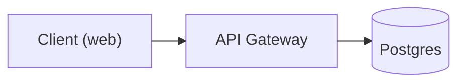

# Diagram as Code

Produce diagrams via local CLIs, then **look at the rendered image and fix what's wrong** before
handing it over. A diagram that compiles is not a diagram that reads well — the render/read-back
loop is the point of this skill, not an optional extra.

Not this skill: a full system design document → use `design-doc`. It drives this toolchain for every
figure it embeds, so the rules below apply there too; it adds only the print-specific parts (PDF
export, page sizing, a shared palette).

## Step 1 — Pick the tool

| Situation | Tool | Why |
|---|---|---|
| **Default.** Lives in a README, PR, or Markdown doc | **Mermaid** (`mmdc`) | Renders natively on GitHub; models write it most reliably |
| Real system architecture: containers, nesting, icons, >25 nodes | **D2** (`d2`) | Better layout on dense graphs, no browser, custom SVG icons |
| Several views of one system that must stay consistent | **Structurizr DSL** | One model → System Context / Container / Component views; C4 rules enforced |
| Cloud or MLOps infrastructure with vendor icons | **`diagrams-py`** | mingrammer/diagrams — AWS/GCP/Azure/K8s icon sets |
| PyTorch model internals | **torchview** (per-project dep) | Headless Graphviz render with shapes; Netron has no CLI export |

When unsure, use Mermaid. Switch to D2 only when Mermaid's layout visibly fails.

## Step 2 — Constrain before generating

Decide these *before* writing any DSL. Most bad diagrams are bad because this step was skipped.

- **Scope and audience.** One diagram answers one question. Say which in the title.
- **One abstraction level per diagram.** Never mix "Postgres" with "UserRepository.findById".
- **Node budget: 15–20 max.** Past that, split into two diagrams instead of shrinking the font.
- **Direction:** `LR` for pipelines and request flows, `TB` for hierarchies and layered stacks.
- **Error paths are opt-in for models — so opt in explicitly.** Benchmarks show LLM-generated
  diagrams are strongest on syntax and weakest on failure/error flows. If the thing being drawn can
  fail, draw the failure edge.
- **If the layout engine can't route it without crossings, the diagram is too complex.** Cut nodes;
  don't fight the engine.

## Step 3 — Write the source

Save sources next to their docs (`docs/diagrams/<name>.mmd` / `.d2`) and commit them. The source is
the artifact; the image is a build output.

### Mermaid rules that prevent 90% of failures

- **Quote every label containing anything but letters, digits, and spaces:**
  `A["Client (web)"]`, `B["User's profile"]`, `C["auth/token"]`.
  Unquoted `( ) [ ] { } : . , / \ ' &` break the parser.
- Node **IDs** may not contain spaces; labels may. No space between ID and bracket.
- `sequenceDiagram` does **not** support `style` directives. Do not emit them.
- Use ELK for anything non-trivial (flowchart and state diagrams only):



`mmdc` bundles the ELK layout engine, so this works locally with no setup. **Caveat:** GitHub's
renderer does not ship ELK — if the diagram is destined for a README, verify it still reads
acceptably without the `layout: elk` block, or commit the rendered SVG instead.

### D2 rules

- One consistent syntax for everything; containers nest with `{ }`.
- Always pass `--layout elk` — the default `dagre` produces more crossings.
- Do not use TALA; it is proprietary and watermarks without a paid license.

```d2
client: Client (web) { shape: rectangle }
api: API Gateway
db: Postgres { shape: cylinder }
client -> api: HTTPS
api -> db: SQL
```

## Step 4 — Render

```bash
# Mermaid → PNG for self-review (-s 2 = 2x scale, legible text)
mmdc -i docs/diagrams/arch.mmd -o /tmp/arch.png -s 2 -b white

# Mermaid → SVG artifact for docs
mmdc -i docs/diagrams/arch.mmd -o docs/diagrams/arch.svg -b transparent

# Mermaid → PDF (for LaTeX embedding). --pdfFit crops to the diagram instead of
# padding to US Letter. Always let mmdc export raster/PDF itself: a Mermaid SVG
# put through rsvg-convert loses every node label, because Mermaid draws labels
# in <foreignObject> HTML and librsvg does not implement it. `htmlLabels: false`
# is not a fix — node labels still vanish and label spaces collapse.
mmdc -i docs/diagrams/arch.mmd -o docs/diagrams/arch.pdf --pdfFit -b white

# D2 → SVG artifact, then rasterize for self-review.
# Do NOT use `d2 in.d2 out.png` — PNG export is broken in this nixpkgs build
# (it tries to download a Playwright driver at runtime and 404s).
d2 --layout elk docs/diagrams/arch.d2 docs/diagrams/arch.svg
rsvg-convert -z 2 -o /tmp/arch.png docs/diagrams/arch.svg

# Structurizr: one model → many consistent views, exported as Mermaid
structurizr-cli export -workspace docs/workspace.dsl -format mermaid -output docs/diagrams/

# Python diagrams (mingrammer) — writes its own PNG
diagrams-py docs/diagrams/pipeline.py
```

A non-zero exit from `mmdc` or `d2` is a syntax error: read the message, fix the source, re-render.
Never hand back a diagram that failed to render.

## Step 5 — Read the image back (do not skip)

`Read` the PNG and check it against this list. This is the step that separates a clean diagram from
a technically-valid one.

**Visual:**
- [ ] Any text overlapping a shape, an edge, or other text?
- [ ] Any edge crossings that could be removed by flipping direction or regrouping?
- [ ] Is the aspect ratio sane, or is it a 300×4000 ribbon? (usually means wrong direction)
- [ ] Are labels legible at 100% zoom, or shrunk to fit?
- [ ] Any node so large it dwarfs the rest? (usually an over-long label)

**Content (C4 review checklist, Simon Brown):**
- [ ] Does the diagram have a **title**, and is its **scope** and **type** clear?
- [ ] Is there a **key/legend** for every colour, shape, line style, and icon used?
- [ ] Does every element have a name, a clear type/abstraction level, and — where relevant — its
      technology choice?
- [ ] **Does every arrow have a label describing intent?** Unlabelled arrows are the most common
      defect in generated diagrams.
- [ ] Does each arrow's description match its direction?
- [ ] Is every acronym and abbreviation explained?

Fix and re-render. **Cap at 3 iterations** — if it still doesn't read well, the diagram is too
complex: split it and say so.

## Step 6 — Deliver

- Commit the **source** (`.mmd`/`.d2`/`.dsl`) plus the rendered **SVG**.
- For GitHub-facing Markdown, prefer an inline ```mermaid fenced block so it renders in-page and
  stays diffable; attach the SVG only when ELK or D2 features are required.
- Say which tool and layout engine you used, so the next edit uses the same one.
- Delete scratch PNGs from `/tmp`; don't commit review renders.

## ML-specific notes

- **Model internals:** `torchview.draw_graph(model, input_size=...)` → Graphviz; renders headless
  and shows tensor shapes. Add `torchview` + `graphviz` to that project's env, not globally.
- **Netron is inspection-only** — it has no CLI/Python image export, so never make it a build step.
- **Papers:** PlotNeuralNet (Python → LaTeX/TikZ) for conference-style CNN block diagrams.
- **Pipelines and serving infra:** `diagrams-py` with the appropriate provider icon set — draw the
  data/serving path (feature store → training → registry → inference), not the model internals.

## Reference: available commands

| Command | Purpose |
|---|---|
| `mmdc` | Mermaid → SVG/PNG/PDF (bundles ELK) |
| `d2` | D2 → SVG (use `--layout elk`) |
| `rsvg-convert` | SVG → PNG for read-back review |
| `dot` | Graphviz |
| `structurizr-cli` | C4 model → Mermaid/PlantUML/DOT/JSON |
| `plantuml` | Render PlantUML / C4-PlantUML exports |
| `diagrams-py` | Python with mingrammer/diagrams available |

All are provided by `shared/home/diagrams.nix`. If one is missing, the config needs a rebuild —
say so rather than falling back to an MCP server or an online renderer.
